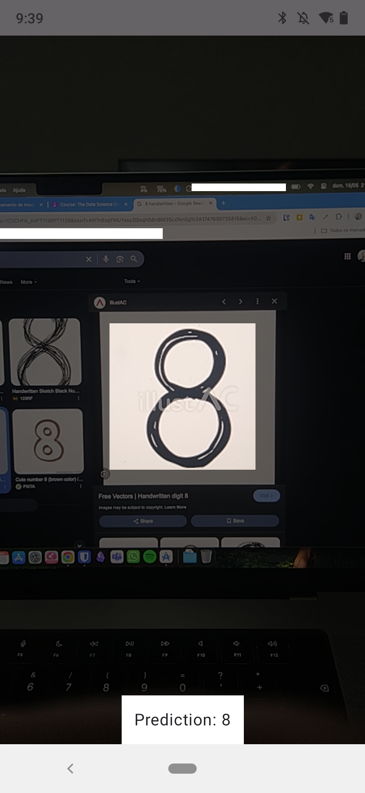

# MNIST Character Recognition Android App

This project is a practical blend of my Android development experience and machine learning studies from the course [The Data Science Course: Complete Data Science Bootcamp 2025](https://www.udemy.com/course/the-data-science-course-complete-data-science-bootcamp), specifically **Module 52**, where we build a character recognition model using TensorFlow 2.0 and the MNIST dataset.

The app captures grayscale camera frames, processes a central cropped region, resizes it to 28x28, and feeds it into a TensorFlow Lite model to predict the handwritten digit. It's designed to demonstrate how a classic deep learning model can be embedded into a real-time mobile application.

## Model Architecture
The model used in this project is a simple Sequential Neural Network built using TensorFlow 2.0. It is designed to classify handwritten digits from the MNIST dataset, which contains grayscale images of 28x28 pixels.

## Architecture Details
* Input Layer: Each 28x28 image is flattened into a 1D array of 784 elements.

* Dense Layer 1: 50 neurons with ReLU activation.

* Dense Layer 2: 50 neurons with ReLU activation.

* Output Layer: 10 neurons with Softmax activation, representing the probability of each digit (0 through 9).

The use of ReLU activation in the hidden layers enables the model to learn complex patterns, while the Softmax activation in the final layer ensures that the output values represent probabilities summing to 1.

## Features

- Real-time camera input using CameraX
- Grayscale processing and cropping logic
- Histogram-based filtering to reduce redundant predictions
- Embedded TensorFlow Lite model (trained on MNIST)
- ViewModel and coroutine-based architecture for clean separation of UI and processing

## Screenshots

<!-- Replace with actual screenshots -->
 

## Planned Improvements

- [ ] Add FPS counter or inference time metrics
- [ ] Add support for drawing on the screen instead of using the camera
- [ ] Add option to toggle histogram difference filtering
- [ ] Use ML delegates (e.g., GPU delegate) for faster inference
- [ ] Improve the histogram comparison with Chi-squared distance
- [ ] Provide visual feedback on the detected region
- [ ] Add UI toggle for mask size or crop area
- [ ] Integrate confidence score in the UI
- [ ] Replace raw array manipulation with bitmap/RenderScript processing for better performance and clarity
- [ ] Improve modularization (e.g., inject `FrameManager` using DI like Hilt)
- [ ] Write unit tests for core logic

## How to Run

1. Clone the repository
2. Open in Android Studio
3. Build and run on a device (Camera is required)
4. The model will predict digits from the central area of the frame in real time

## License

MIT – feel free to use this as a base for your own Android + ML experiments.
