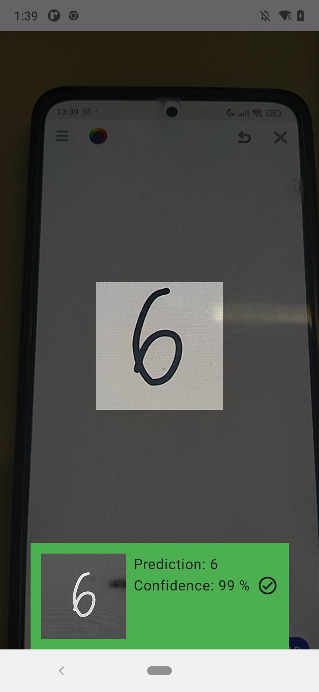

  

# InkSight - MNIST Character Recognition Android App

This project is a practical blend of my Android development experience and machine learning studies from the course [The Data Science Course: Complete Data Science Bootcamp 2025](https://www.udemy.com/course/the-data-science-course-complete-data-science-bootcamp), specifically **Module 52**, where we build a character recognition model using TensorFlow 2.0 and the MNIST dataset.

The app captures grayscale camera frames, processes a central cropped region, resizes it to 28x28, and feeds it into a TensorFlow Lite model to predict the handwritten digit. It's designed to demonstrate how a classic deep learning model can be embedded into a real-time mobile application.

## Jupyter Notebook

The project also includes a Jupyter notebook containing all the steps for:

- Dataset extraction and loading
- Preprocessing
- Model creation using TensorFlow 2.0
- Training and evaluation

You can find it here: [TensorFlow_MNIST_Part1_with_comments.ipynb](jupyter/TensorFlow_MNIST_Part1_with_comments.ipynb)

## Model Architecture

The model used in this project is a simple Sequential Neural Network built using TensorFlow 2.0. It is designed to classify handwritten digits from the MNIST dataset, which contains grayscale images of 28x28 pixels.

## Architecture Details

* Input Layer: Each 28x28 image is flattened into a 1D array of 784 elements.
* Dense Layer 1: 50 neurons with ReLU activation.
* Dense Layer 2: 50 neurons with ReLU activation.
* Output Layer: 10 neurons with Softmax activation, representing the probability of each digit (0 through 9).

The use of ReLU activation in the hidden layers enables the model to learn complex patterns, while the Softmax activation in the final layer ensures that the output values represent probabilities summing to 1.

## Features

- Real-time camera input using CameraX
- Grayscale processing and cropping logic
- Histogram-based filtering to reduce redundant predictions
- Embedded TensorFlow Lite model (trained on MNIST)
- ViewModel and coroutine-based architecture for clean separation of UI and processing

## Performance & Best Practices Recommendations

To further enhance the application's robustness and efficiency, the following improvements are suggested:

- **Bitmap Pooling**: Implement a pool to reuse `Bitmap` objects during real-time frame processing. This reduces memory allocations and mitigates Garbage Collector (GC) pressure, preventing UI stutters.
- **Advanced Room Optimization**: For large history sets, integrate `Paging 3` to load inference data lazily. Additionally, ensure all disk I/O and bitmap decoding consistently use `Dispatchers.IO`.
- **Compose State Stability**: Optimize the `HistoryScreen` by ensuring bitmaps are downsampled to thumbnail sizes before being displayed in the `LazyVerticalGrid` to minimize RAM usage.
- **Robust Backpressure Handling**: Refine the frame analysis pipeline to drop frames if processing time exceeds the frame interval, ensuring the user always sees the most recent prediction.
- **Hardware Acceleration**: Explore the use of `GpuDelegate` for TensorFlow Lite to offload inference from the CPU, potentially improving battery life and thermal performance.

## Screenshots

## How to Run

1. Clone the repository
2. Open in Android Studio
3. Build and run on a device (Camera is required)
4. The model will predict digits from the central area of the frame in real time

## Project Tags

[v1.2.0](https://github.com/joaogouveia89/InkSight/releases/tag/v1.2.0)
> This version brings significant architectural refactoring, UI standardization, and improved code maintainability.
Key improvements include:
- **Modular Refactoring**: Decoupled `history` and `digit_recognition` modules, moving shared persistence to `core.data.local` and implementing independent repositories.
- **Onboarding Modularization**: Completely restructured the onboarding flow using a dynamic `enum` and dedicated composable components for each page with Compose Previews.
- **UI Standardization**: Implemented a semantic spacing scale (Design Tokens) using `CompositionLocal` and `MaterialTheme` extension, ensuring consistent paddings and spacings across the entire app.
- **Layout Robustness**: Replaced manual coordinate calculations in the camera overlay with a declarative proportional layout using weights and aspect ratio.
- **Feature Renaming**: Standardized terminology from "Scanning" to "Digit Recognition" for better domain alignment.

[v1.1.1](https://github.com/joaogouveia89/InkSight/releases/tag/v1.1.1)
> This version introduces Firebase integration for improved app monitoring and crash reporting.
Key improvements include:
- **Firebase Integration**: Successfully integrated Firebase Analytics and Crashlytics for real-time monitoring and crash tracking.
- **Public Repo Readiness**: Configured `google-services.json` security with `.gitignore` and provided a template for public distribution.

[v1.1.0](https://github.com/joaogouveia89/InkSight/releases/tag/v1.1.0)
> This release focuses on significant performance optimizations and major feature additions, including a complete history of predictions.
Key improvements include:
- **History Feature**: Implemented a new screen to view past predictions, including the captured image, confidence, and user feedback (correct/incorrect).
- **Advanced Image Processing**: Refactored the frame processing pipeline to significantly improve image quality before inference. This includes intermediate scaling, adaptive thresholding, and anti-aliasing to preserve stroke integrity.
- **Coroutine Optimization**: Made the entire processing pipeline asynchronous (`suspend`), offloading heavy CPU and I/O operations to background dispatchers (`Dispatchers.Default` and `Dispatchers.IO`) to ensure a fluid, jank-free UI.
- **Repository Pattern Enhancement**: Optimized the `InferenceRepository` to handle file and database I/O efficiently on background threads.

[v1.0.0](https://github.com/joaogouveia89/InkSight/releases/tag/v1.0.0)
> This version represents a significant evolution from the initial proof-of-concept, focusing on architectural robustness and a more refined user experience.
Key improvements include:
- **Project Rebranding**: Officially renamed to **InkSight** with a new custom adaptive icon and cleaned-up package structure.
- **Architecture & Responsibility Segregation**: Moved from a monolithic approach to a clean pipeline where frame processing is decoupled into specific components (`FramePipeline`, `FrameGate`, `FrameProcessor`).
- **Dependency Injection**: Integrated **Hilt** to manage dependencies, improving testability and code maintainability.
- **Enhanced Stability Logic**: Implemented a prediction lock that keeps the result on screen as long as the camera remains stable, preventing flickering and redundant processing.
- **Filter Calibration**: Fine-tuned preprocessing filters and stability thresholds to balance responsiveness and accuracy, resulting in a snappier real-time experience.
- **Modern Tech Stack**: Full implementation using **Jetpack Compose** and **CameraX Viewfinder** for a modern, reactive UI.

[proof-of-concept](https://github.com/joaogouveia89/InkSight/releases/tag/proof-of-concept)
> This initial version focuses primarily on validating the integration between Android’s CameraX API, image preprocessing, and TensorFlow Lite inference in real time.
At this stage, development best practices and architectural patterns were considered but not the main priority — the main goal was to prove the feasibility of capturing a camera frame, performing simple manipulations, running it through a TensorFlow model, and displaying the prediction to the user.
Future tags and releases will aim to refine the architecture, improve maintainability, and introduce cleaner abstractions while preserving the functional core established in this proof of concept.

## License

MIT – feel free to use this as a base for your own Android + ML experiments.
